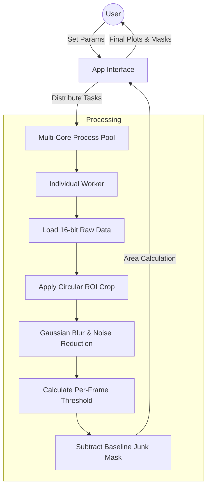

# 🦠Bacteria Bouncer v1.0

Bacteria Bouncer is a high-throughput image analysis pipeline designed to quantify bacterial biomass and growth coverage from 16-bit TIF microscopy frames. It features a robust dynamic thresholding engine that adapts to fluctuating image noise and a multi-threaded GUI for rapid processing.

## 📋Features
- Dynamic Sensitivity Engine: Thresholds are automatically calculated per-frame based on the standard deviation and median values of image noise.
- Parallel Processing: Uses a ProcessPoolExecutor to distribute well analysis across CPU cores for faster results.
- Customizable Parameters: Real-time adjustment of Blur kernel, Crop radius, and Sensitivity via the GUI.

## ⚒️Architecture


## 🔬 Analysis Pipeline

This example demonstrates the transition from raw microscopy data to the final quantified growth curve.

| 1. Input (Raw Frame) | 2. Processing (Engine) | 3. Output (Data Plot) |
| :--- | :---: | :--- |
|  | ⚙️ <br> **Dynamic <br> Sensitivity <br> Engine** |  |
| *16-bit Raw TIF* | *Noise Reduction & Thresholding* | *Biomass Quantification* |

### Pipeline Breakdown:
1. **Input:** The raw 16-bit `.tif` frame is loaded. The engine handles the low contrast and high noise levels typical of bright-field imaging.
2. **Processing:** - **Gaussian Blur:** Smooths background noise.
   - **Dynamic Thresholding:** Automatically calculates sensitivity based on per-frame standard deviation.
   - **ROI Crop:** Removes well-edge artifacts.
3. **Output:** The final quantification is exported as a high-resolution plot, showing the calculated biomass area or growth coverage over the duration of the experiment.

## 📦Installation

Downloading the program:

```bash
# Clone the repository
git clone https://github.com/wenkwonk/bacteriabouncer.git
cd bacteriabouncer

# Install dependencies
pip install -r requirements.txt
```

Running the program:

- Option 1: Running the Script

    Run the ```bacteria_bouncer_gui.py``` directly using Python

- Option 2: Creating a Standalone App

    For MacOS(.app):
    ```
    pyinstaller --noconsole --onefile --add-data "icon.icns:." --icon=icon.icns bacteria_bouncer_gui.py
    ```

    For Windows(.exe):
    ```
   pyinstaller --noconsole --onefile --add-data "icon.ico;." --icon=icon.ico bacteria_bouncer_gui.py
    ```