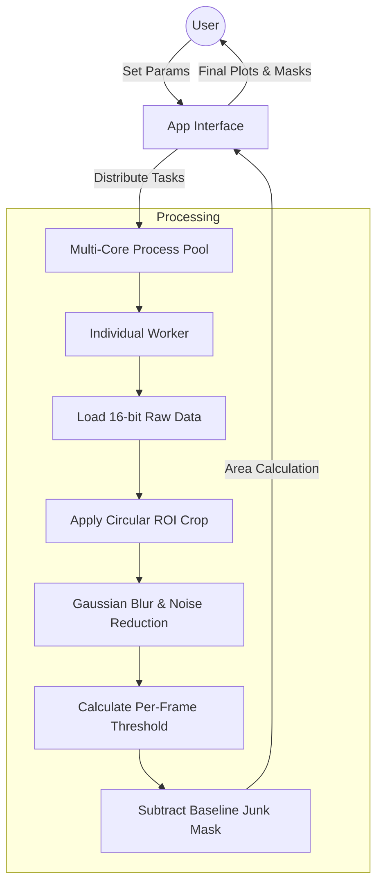
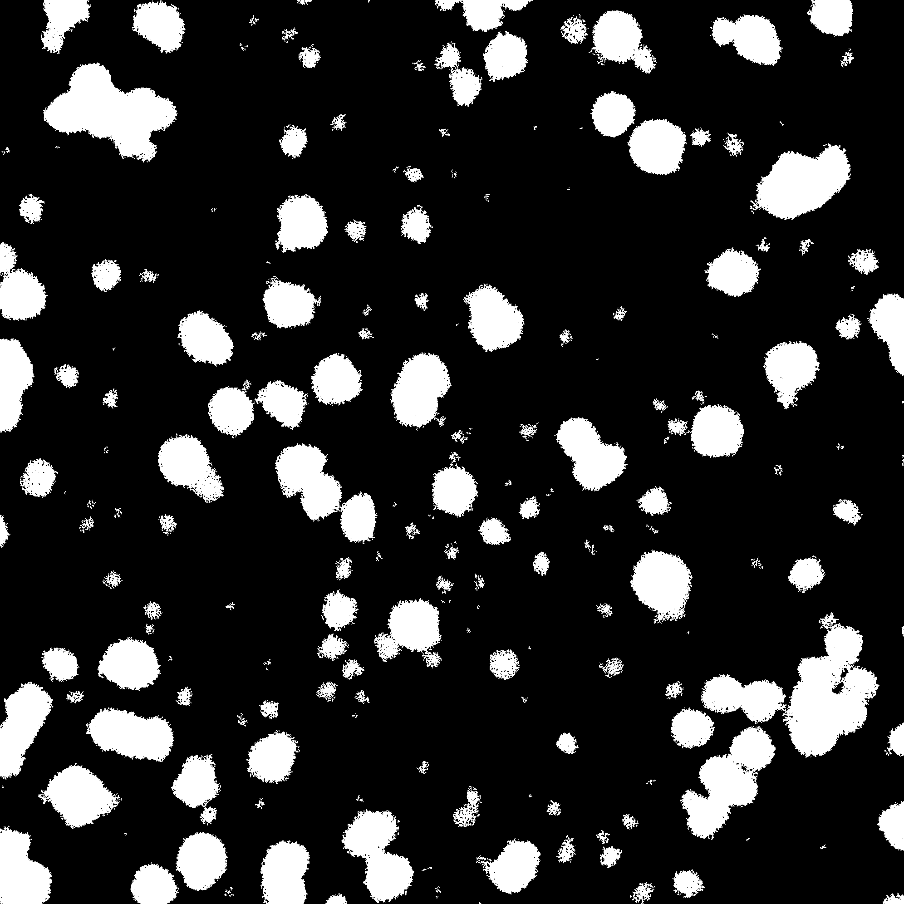
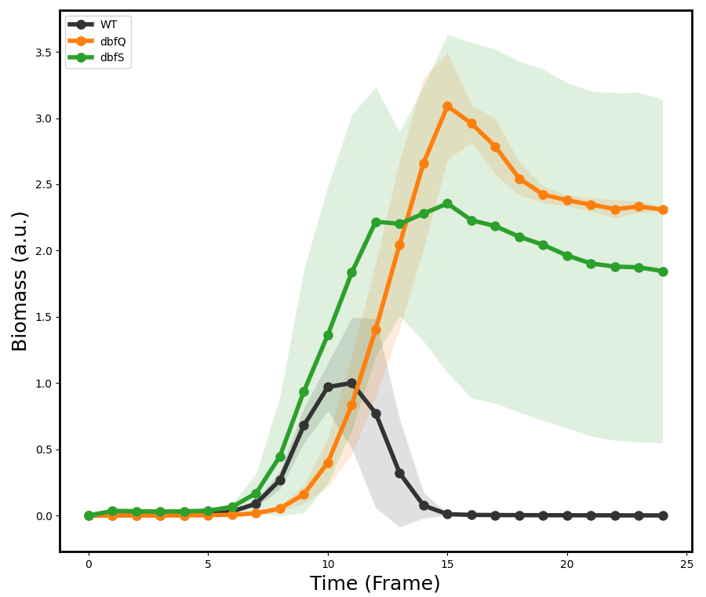

# 🦠Bacteria Bouncer v1.1

Bacteria Bouncer is a high-throughput image analysis pipeline designed to quantify bacterial biomass and growth coverage from 16-bit TIF microscopy frames. It features a robust dynamic thresholding engine that adapts to fluctuating image noise and a multi-threaded GUI for rapid processing.

## 📋Features
- Dynamic Sensitivity Engine: Thresholds are automatically calculated per-frame based on the standard deviation and median values of image noise.
- Dynamic Junk Masking: Decays junk masking in inverse relation to pixel community support and per-frame standard deviation
- Parallel Processing: Uses a ProcessPoolExecutor to distribute well analysis across CPU cores for faster results.
- Customizable Parameters: Real-time adjustment of Blur kernel, Crop radius, and Sensitivity via the GUI.

## ⚒️Architecture


## 🔬 Analysis Pipeline

Bacteria Bouncer automates the transition from noisy 16-bit raw data to publication-ready growth metrics.

| 1. Input (Raw Frame) | 2. Processed (Engine View) | 3. Output (Data Plot) |
| :---: | :---: | :---: |
|  |  |  |
| *16-bit Raw Data* | *Blur & Thresholding* | *Area Quantification* |

### Pipeline Breakdown:
1. **Input:** The raw 16-bit frame is loaded. The engine is optimized for the low contrast and high-dynamic range typical of bright-field microscopy.
2. **Processed:** The **Dynamic Sensitivity Engine** applies a Gaussian blur to smooth noise and calculates a per-frame threshold. This view demonstrates how the software isolates candidate biomass from the background.
3. **Output:** The final result is exported as a high-resolution plot showing bacterial coverage over time, allowing for rapid comparison between experimental conditions.

## 📦Installation

Downloading the program:

```bash
# Clone the repository
git clone https://github.com/wenkwonk/bacteriabouncer.git
cd bacteriabouncer

# Install dependencies
pip install -r requirements.txt
```

Running the program:

- Option 1: Running the Script

    Run ```bacteria_bouncer_gui.py``` directly using Python

- Option 2: Creating a Standalone App

    For MacOS(.app):
    ```
    pyinstaller --noconsole --onefile --add-data "icon.icns:." --icon=icon.icns bacteria_bouncer_gui.py
    ```

    For Windows(.exe):
    ```
   pyinstaller --noconsole --onefile --add-data "icon.ico;." --icon=icon.ico bacteria_bouncer_gui.py
    ```